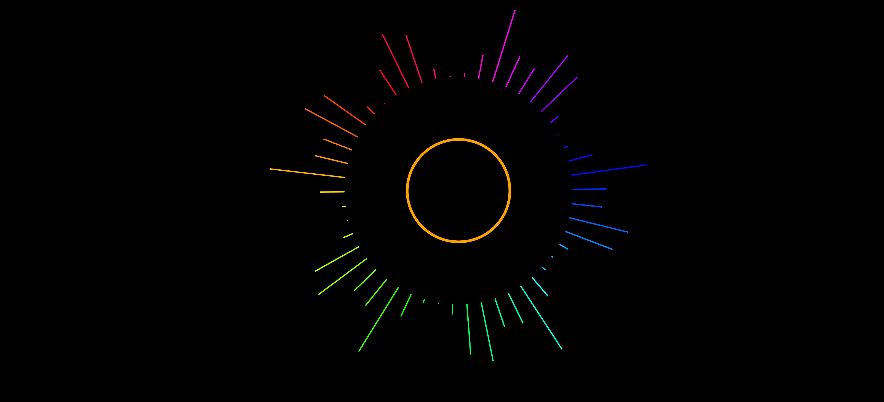

# Music Visualiser Project

Name: Dylan Convery

Student Number: D14124700

# Description of the assignment
For this assignment I chose to try implement a reactive ring similar to the one I use with Wallpaper
Engine found here - [hyperlink](https://steamcommunity.com/sharedfiles/filedetails/?id=1081733658). It is an audio
reactive ring which rotates depending on the amplitude of the sound and creates spinning spines depending
on the audio bands.

# Instructions
To use, simply compile and run the program. It currently loads a music file from the data folder but can be
modified to work with any audio file or stream. It has play and pause functionality.

# How it works
It makes use of Minim's FFT class to do a fast fourier transform which then allows the program to react to the 
audio frequences in the time domain. What this allows me to do is map these frequences to the spines that 
are drawn to the screen. This can be seen being doing in this snippet of code: 

```Java
 public void render() {
    float theta = PApplet.TWO_PI / (float) spines; 
    float[] bands = visualizer.getSmoothedBands(); 
    float band = 0;
    ...
    visualizer.pushMatrix(); 
    visualizer.translate(x, y); 

    for (int i = 0; i < spines; i++) {
        float offset = 0; 
        visualizer.stroke(PApplet.map(i, 0, spines, 0, 255), 255, 255); 
        band = bands[i % bands.length];
        float x1 = (radius * PApplet.sin(i * theta));
        float y1 = (radius * PApplet.cos(i * theta));
        float x2 = ((radius + band) * PApplet.sin(i * theta));
        float y2 = ((radius + band ) * PApplet.cos(i * theta));

        visualizer.line(x1, y1, x2, y2);
    }
    visualizer.popMatrix();
    ...
}
```

The center ring also makes use of Minim to get our overall amplitude of the audio track. It then grows and
shrinks accordingly. This can be seen implemented in this code snippet:

```Java
public void render() {
    ...
    float size = width + (visualizer.getSmoothedAmplitude() * intensity);
    smoothed_size = PApplet.lerp(smoothed_size, size, 0.5f);
    visualizer.ellipse(x, y, smoothed_size, smoothed_size);
    ...
}
```


# What I am most proud of in the assignment
I'm most proud of the fact that I was able to get the spines drawing to the screen within a set border. It was
a huge struggle getting this to work with few examples to go by. I'm also happy I was able to understand the 
underlying math responsible for drawing everything.

#Screenshot


#Video Demonstration:

[](https://youtu.be/i4wQ0VKXoTI)
